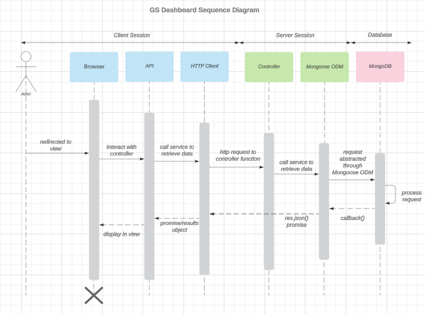

**_Professional Self-Assesment_**

My experience in the SNHU Computer Science program has taught me a lot. Not always what I expected to learn, but many important lessons for life and work. There were many cases of course work falling outside of my career aspirations. The computer graphics work, for example, which I did not want to complete. Because I had no interest in the subject matter, results, or industry - I struggled with that course. But there was a unique reward in completing the course. I gained a new respect for the software environment. Which was the source of most of my problems in that course. This highlighted a thread which ran through all my previous software experience. That the software environment is an important and often overlooked aspect of development. Immediately, I saw where environment issues were causing delays in development at work. This lesson is something hard to teach and difficult to forget. It is one of many such lessons that I can now bring forward with me into my career.

 Collaboration is not evident in this portfolio, but it was core to each course in this degree. Every course had a group discussion running parallel with the material and assignments. This discussion was as valuable as the material. In some cases, it was the most valuable. There is unlimited information available to any developer. But when you don't know the right question, it is difficult to find the right answer. This is another lesson that takes time and hands-on experience to learn. Many times, the discussions and knowledge sharing saved me hours of research. My approach to new problems at work has become much more collaborative. Because now my options are clear. Save my ego and never look like I don't know something. Or ask others what they already know and save my time. 

 The rest of this ePortfolio showcases the technical skills gained in the program. The portfolio centers around one artifact and three enhancements. In CS-340 (Client Server Development), we built a company dashboard application. This was a full stack application using Dash, Python, and MongoDB. The three enhancements showcase skill development in three categories. The categories of: "Software Design and Engineering", "Algorithms and Data Structures", and "Databases". The first enhancement is a Software Design Document. The second enhancement is a token-based authorization system. The third enhancement is user interactive CRUD functionality.


**_Code Review_**

Code reviews are an important step in the software development process. They can help identify bugs, performance issues, and vulnerabilities. They also ensures compliance and adherence to industry standards. Code review can also promote a collaborative development environment. Though the reviews might seem painful. If done constructively, the developers can gain a lot from the process. 

Best practices include starting with the end in mind. Meaning setting clear goals at the outset of the review. Another is making the review process incremental. Or reviewing code in small batches. Also, making sure the review gets done in a constructive way. Meaning the avoidance of blame or negative criticism of the developers. 

The goal of code reviews is avoid errors in production code. So it should happen after development but before deployment. Testing can be a component of development. But much of it gets done after development. So code reviews and testing can inform one another in the same stage. 

My code review was recorded with ScreenPal. The review does start with the end in mind. It used an outline that included the goals of the capstone improvements. The focus was on finding errors and identifying areas for improvement. 

The full code review is available [here](https://drive.google.com/drive/folders/1Pq5_oSiOKD_sdR8QveYq3-UdLQvCF-kj?usp=drive_link).


**_Enhancement One - Software Design and Engineering_**



This artifact was not included in the original CS-340 project. I saw room for a software design document. Writing these documents was an assignment in a few other courses. Including this in CS-340 would have been valuable. Then again, many students see the SDD as getting in the way of the coding content of the class. But I have been working in software for two years. I now see the value in understanding the original designs of an application. 

As I wrote the SDD, I realized how inexperienced I was with software architecture. The challenge was in designing my planned enhancements. The software design documents I wrote in previous classes came with planned architecture. Planning  something new required a lot of thought, diagramming, and pseudo-code. So it was a valuable experience. I plan to use all this at work in the very near future.  

Excerpt from the SDD:
> Design Constraints 

> The Grazioso Salvare web app comes with unique constraints. The following factors guide our design. 
> We must stick to a set timeline for development, testing, and release. This means meeting milestones and deadlines. This requires good project management, prioritization, and streamlined development. 
> Grazioso Salvare expects the app to grow. It must be able to handle more users and data. So, the design needs to easily scale up. This means using tech that allows the app to grow without losing speed. 
> The app must meet security standards and follow laws like GDPR and PCI DSS. Standard security practices should limit the minimal risk of the application. 
> The app may need to connect with legacy systems or external apps. So it needs to work with existing systems and share data. This needs thorough planning to avoid issues and keep data secure. 
> These are our critical design constraints. Meeting them well will ensure a secure, scalable, and user-friendly app that meets requirements. 

The goal of this enhancement was to meet these outcomes:  
* Employ strategies for building collaborative environments that enable diverse audiences to support organizational decision-making in the field of computer science.  
* Design, develop, and deliver professional-quality oral, written, and visual communications that are coherent, technically sound, and appropriately adapted to specific audiences and contexts.  

The full artifact is available [here](https://docs.google.com/document/d/1M5LXvOl6ZkGq1Qb3N8o2LZ87tHONZpiK/edit?usp=drive_link&ouid=101641056580444605866&rtpof=true&sd=true).


Text can be **bold**, _italic_, or ~~strikethrough~~.

[Link to another page](./another-page.html).

There should be whitespace between paragraphs.

There should be whitespace between paragraphs. We recommend including a README, or a file with information about your project.

# Header 1

This is a normal paragraph following a header. GitHub is a code hosting platform for version control and collaboration. It lets you and others work together on projects from anywhere.

## Header 2

> This is a blockquote following a header.
>
> When something is important enough, you do it even if the odds are not in your favor.

### Header 3

```js
// Javascript code with syntax highlighting.
var fun = function lang(l) {
  dateformat.i18n = require('./lang/' + l)
  return true;
}
```

```ruby
# Ruby code with syntax highlighting
GitHubPages::Dependencies.gems.each do |gem, version|
  s.add_dependency(gem, "= #{version}")
end
```

#### Header 4

*   This is an unordered list following a header.
*   This is an unordered list following a header.
*   This is an unordered list following a header.

##### Header 5

1.  This is an ordered list following a header.
2.  This is an ordered list following a header.
3.  This is an ordered list following a header.

###### Header 6

| head1        | head two          | three |
|:-------------|:------------------|:------|
| ok           | good swedish fish | nice  |
| out of stock | good and plenty   | nice  |
| ok           | good `oreos`      | hmm   |
| ok           | good `zoute` drop | yumm  |

### There's a horizontal rule below this.

* * *

### Here is an unordered list:

*   Item foo
*   Item bar
*   Item baz
*   Item zip

### And an ordered list:

1.  Item one
1.  Item two
1.  Item three
1.  Item four

### And a nested list:

- level 1 item
  - level 2 item
  - level 2 item
    - level 3 item
    - level 3 item
- level 1 item
  - level 2 item
  - level 2 item
  - level 2 item
- level 1 item
  - level 2 item
  - level 2 item
- level 1 item

### Small image


### Large image


### Definition lists can be used with HTML syntax.

<dl>
<dt>Name</dt>
<dd>Godzilla</dd>
<dt>Born</dt>
<dd>1952</dd>
<dt>Birthplace</dt>
<dd>Japan</dd>
<dt>Color</dt>
<dd>Green</dd>
</dl>

```
Long, single-line code blocks should not wrap. They should horizontally scroll if they are too long. This line should be long enough to demonstrate this.
```

```
The final element.
```
